# 📊 Análise Completa da Aplicação Academia App

## 🏗️ Arquitetura Geral

### Estrutura do Projeto
```
academia-app/
├── src/
│   ├── components/      # Componentes reutilizáveis
│   ├── contexts/        # Contextos React (Auth, Theme, Notification)
│   ├── hooks/           # Hooks customizados
│   ├── navigation/      # Navegação por perfil
│   ├── screens/         # Telas organizadas por perfil
│   ├── services/        # Serviços (Firebase, APIs)
│   └── utils/           # Utilitários
├── functions/           # Cloud Functions
└── firestore.rules     # Regras de segurança
```

## 🔐 Sistema de Autenticação e Autorização

### Fluxo de Autenticação
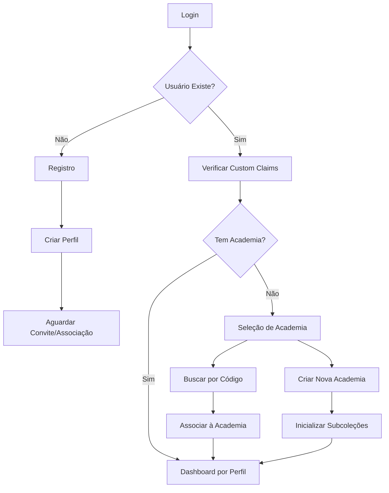

### Perfis de Usuário
- **Admin**: Controle total da academia
- **Instrutor**: Gerenciamento de aulas e alunos
- **Aluno**: Visualização de dados pessoais e pagamentos

## 🏢 Estrutura de Dados (Firestore)

### Coleções Principais
```
gyms/{academiaId}/
├── students/           # Alunos
├── instructors/        # Instrutores
├── classes/            # Turmas
├── modalities/         # Modalidades
├── plans/              # Planos de pagamento
├── payments/           # Pagamentos
├── announcements/      # Avisos
├── invites/            # Convites
├── graduations/        # Graduações
├── evaluations/        # Avaliações físicas
├── injuries/           # Lesões
├── checkins/           # Check-ins
└── notifications/      # Notificações
```

## 📱 Funcionalidades por Perfil

### 👑 ADMIN - Funcionalidades

#### Dashboard Admin
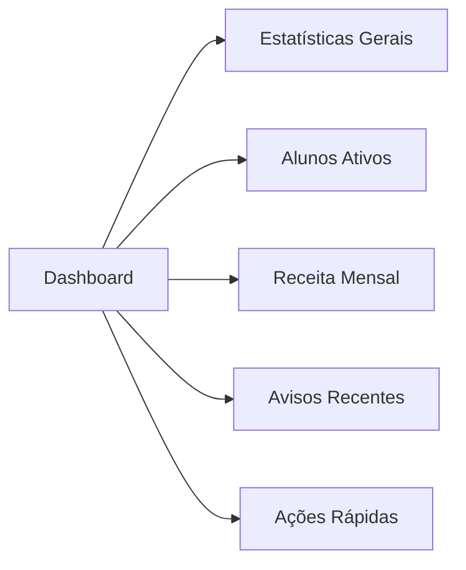

#### Gestão de Alunos
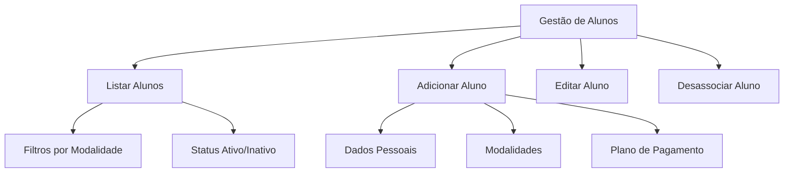

#### Gestão de Turmas
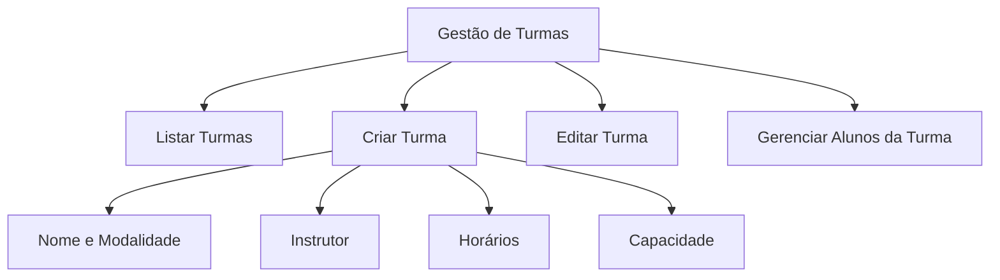

#### Gestão de Modalidades
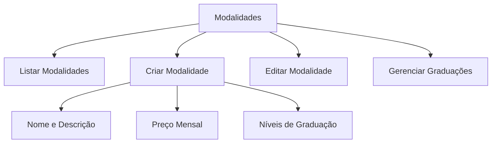

#### Sistema de Convites
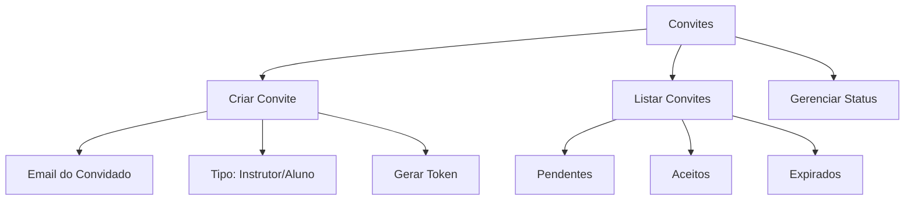

### 👨‍🏫 INSTRUTOR - Funcionalidades

#### Dashboard Instrutor
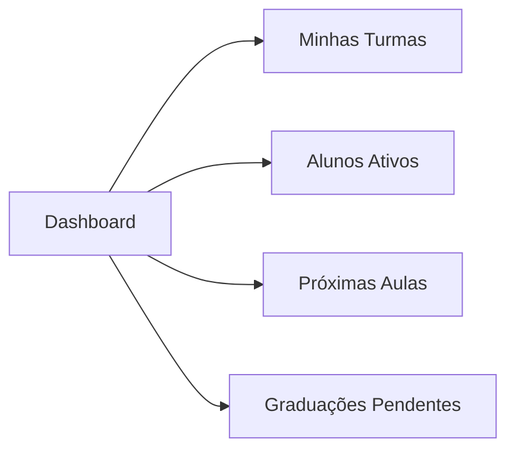

#### Gestão de Aulas
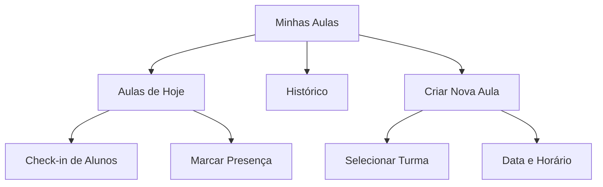

#### Gestão de Alunos
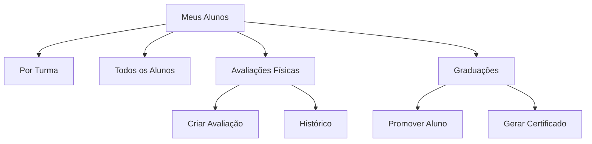

### 👨‍🎓 ALUNO - Funcionalidades

#### Dashboard Aluno
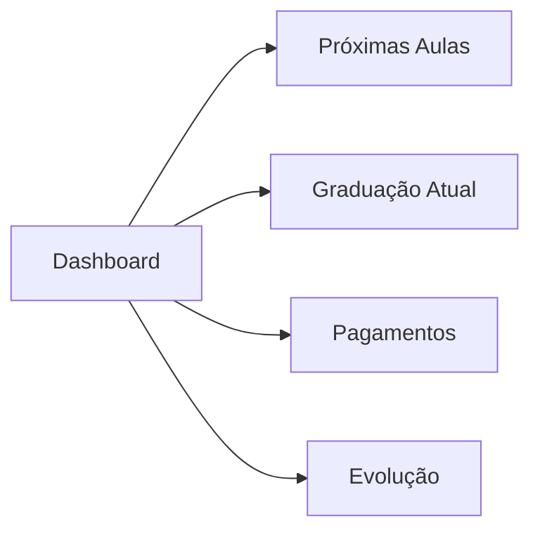

#### Check-in
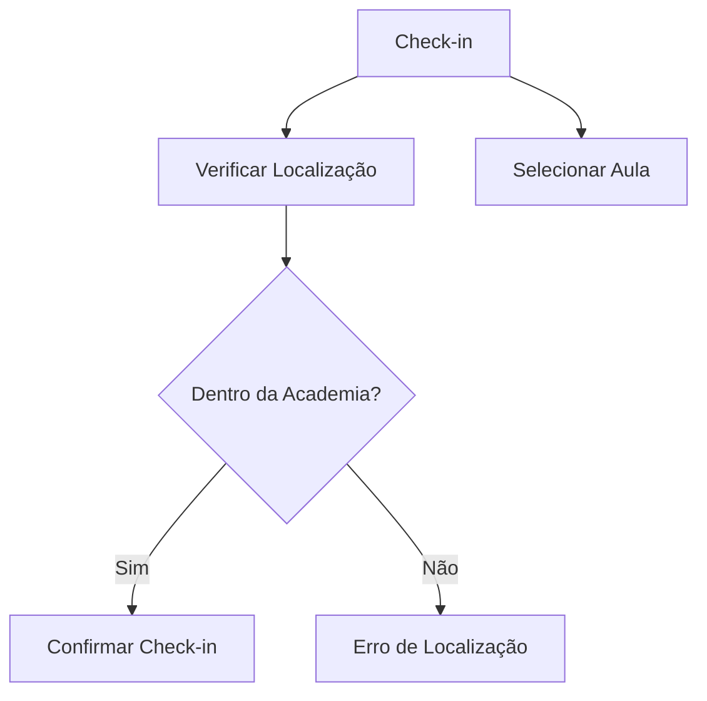

#### Pagamentos
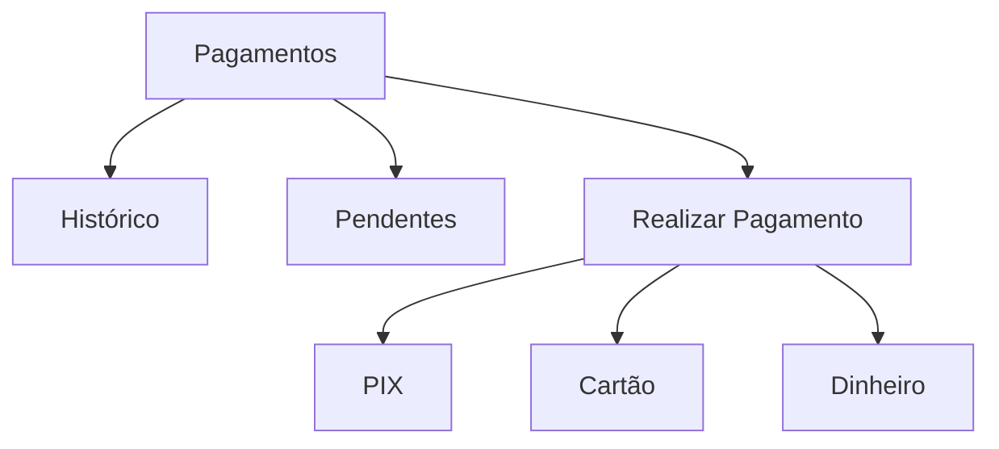

#### Evolução
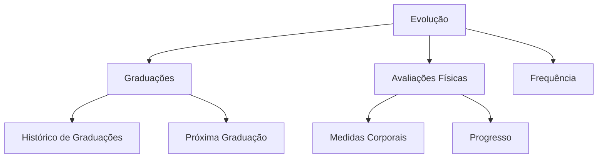

## 🔄 Fluxos Principais

### 1. Fluxo de Criação de Academia
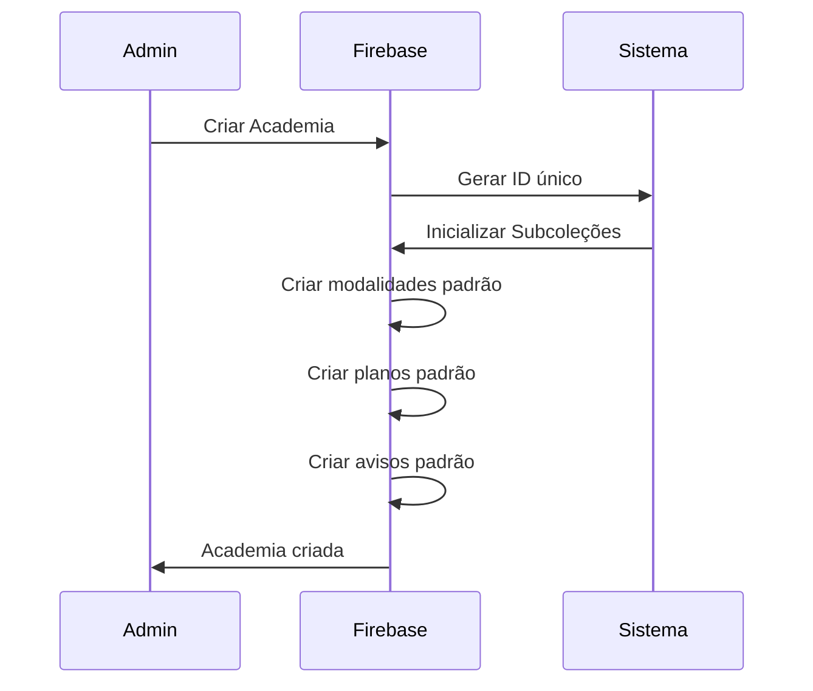

### 2. Fluxo de Convite e Associação
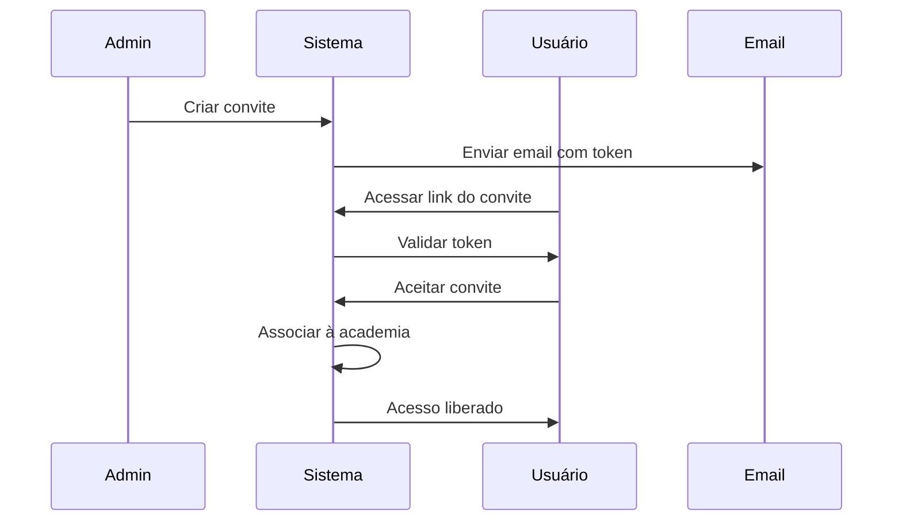

### 3. Fluxo de Check-in
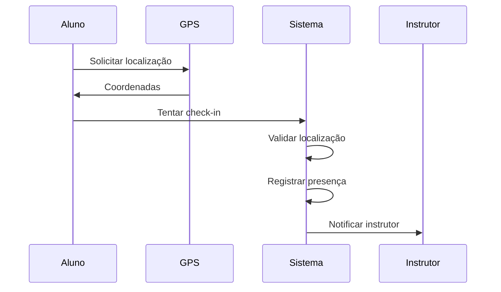

### 4. Fluxo de Pagamento
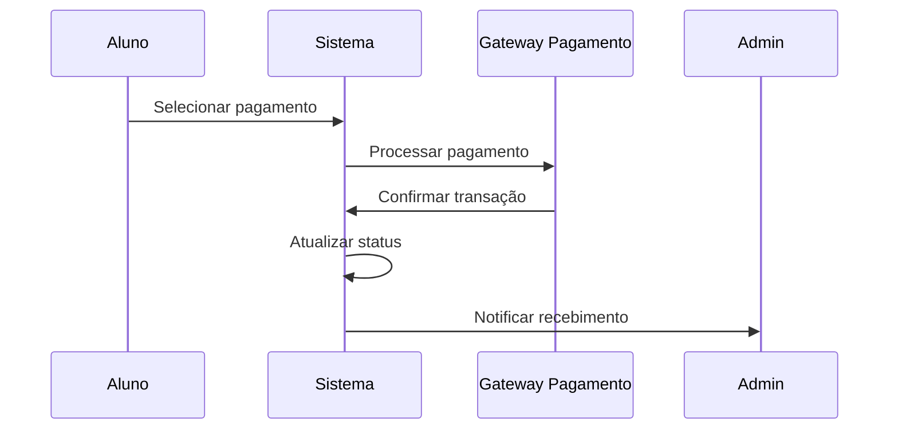

## 🛡️ Segurança (Firestore Rules)

### Estrutura de Segurança
```javascript
// Custom Claims utilizados
{
  role: 'admin' | 'instructor' | 'student',
  academiaId: 'gym_id',
  superAdmin: true // para admins da plataforma
}
```

### Níveis de Acesso
- **SuperAdmin**: Acesso a todas as academias
- **Admin**: Acesso total à sua academia
- **Instrutor**: Acesso às suas turmas e alunos
- **Aluno**: Acesso apenas aos seus dados

## 📊 Métricas e Relatórios

### Relatórios Admin
- Receita mensal/anual
- Frequência de alunos
- Modalidades mais populares
- Taxa de retenção
- Pagamentos em atraso

### Relatórios Instrutor
- Frequência por turma
- Evolução dos alunos
- Graduações realizadas
- Avaliações físicas

## 🔧 Serviços e Integrações

### Serviços Implementados
- **Firebase Auth**: Autenticação
- **Firestore**: Banco de dados
- **Firebase Functions**: Lógica backend
- **Expo Notifications**: Notificações push
- **Geolocation**: Check-in por localização

### APIs Externas
- Gateway de pagamento (PIX/Cartão)
- Serviço de email (convites)
- Maps API (localização)

## 🚀 Funcionalidades Avançadas

### 1. Sistema de Graduações
- Níveis por modalidade
- Certificados digitais
- Histórico completo
- Validação por instrutor

### 2. Avaliações Físicas
- Medidas corporais
- Acompanhamento de progresso
- Gráficos de evolução
- Relatórios personalizados

### 3. Sistema de Lesões
- Registro de lesões
- Acompanhamento médico
- Restrições de atividades
- Histórico completo

### 4. Notificações Inteligentes
- Lembretes de aula
- Pagamentos vencendo
- Graduações disponíveis
- Avisos da academia

## 📱 Compatibilidade

### Plataformas Suportadas
- **Web**: React Native Web
- **Mobile**: iOS e Android (Expo)
- **Responsivo**: Adaptável a diferentes telas

### Tecnologias Utilizadas
- React Native + Expo
- Firebase (Auth, Firestore, Functions)
- React Navigation
- React Native Paper (UI)
- Context API (Estado global)

## 🔄 Fluxo de Dados

### Estado Global (Contexts)
- **AuthContext**: Usuário, perfil, academia
- **ThemeContext**: Tema, idioma
- **NotificationContext**: Notificações

### Sincronização
- Real-time com Firestore
- Offline-first (cache local)
- Sincronização automática

## 📈 Escalabilidade

### Arquitetura Preparada Para:
- Múltiplas academias
- Milhares de usuários
- Crescimento horizontal
- Novas funcionalidades

### Performance
- Lazy loading de telas
- Paginação de dados
- Cache inteligente
- Otimização de queries
