# 🎯 Diagramas de Fluxo - Academia App

## 🔐 Fluxo de Autenticação Completo

```mermaid
flowchart TD
    A[Abrir App] --> B{Usuário Logado?}
    B -->|Não| C[Tela de Login]
    B -->|Sim| D[Verificar Custom Claims]
    
    C --> E[Email/Senha]
    C --> F[Registro]
    C --> G[Esqueci Senha]
    
    E --> H{Login Válido?}
    H -->|Não| I[Erro de Login]
    H -->|Sim| D
    
    F --> J[Criar Conta]
    J --> K[Criar Perfil]
    K --> L[Aguardar Associação]
    
    D --> M{Tem Academia?}
    M -->|Não| N[Seleção de Academia]
    M -->|Sim| O[Carregar Dados da Academia]
    
    N --> P[Buscar por Código]
    N --> Q[Criar Nova Academia]
    N --> R[Escanear QR Code]
    
    P --> S{Academia Encontrada?}
    S -->|Sim| T[Associar Usuário]
    S -->|Não| U[Erro: Academia não encontrada]
    
    Q --> V[Preencher Dados]
    V --> W[Criar Academia]
    W --> X[Inicializar Subcoleções]
    X --> T
    
    T --> O
    O --> Y{Qual Perfil?}
    Y -->|Admin| Z[Dashboard Admin]
    Y -->|Instrutor| AA[Dashboard Instrutor]
    Y -->|Aluno| BB[Dashboard Aluno]
```

## 👑 Fluxos do Perfil ADMIN

### Dashboard Admin
```mermaid
flowchart LR
    A[Dashboard Admin] --> B[Estatísticas]
    A --> C[Alunos Ativos]
    A --> D[Receita]
    A --> E[Avisos]
    A --> F[Ações Rápidas]
    
    B --> G[Total Alunos]
    B --> H[Receita Mensal]
    B --> I[Aulas Hoje]
    
    F --> J[Adicionar Aluno]
    F --> K[Criar Turma]
    F --> L[Enviar Convite]
    F --> M[Novo Aviso]
```

### Gestão de Alunos

### Sistema de Convites
```mermaid
flowchart TD
    A[Sistema de Convites] --> B[Criar Convite]
    A --> C[Gerenciar Convites]
    
    B --> D[Email do Convidado]
    D --> E[Tipo de Usuário]
    E --> F{Tipo?}
    F -->|Instrutor| G[Especialidades]
    F -->|Aluno| H[Modalidades]
    G --> I[Gerar Token]
    H --> I
    I --> J[Enviar Email]
    
    C --> K[Convites Pendentes]
    C --> L[Convites Aceitos]
    C --> M[Convites Expirados]
    
    K --> N[Reenviar]
    K --> O[Cancelar]
    L --> P[Ver Detalhes]
    M --> Q[Criar Novo]
```

### Gestão de Turmas
```mermaid
flowchart TD
    A[Gestão de Turmas] --> B[Listar Turmas]
    A --> C[Criar Turma]
    
    B --> D[Turmas Ativas]
    B --> E[Turmas Inativas]
    B --> F[Ações da Turma]
    
    F --> G[Editar Turma]
    F --> H[Gerenciar Alunos]
    F --> I[Ver Horários]
    F --> J[Desativar]
    
    C --> K[Nome da Turma]
    K --> L[Modalidade]
    L --> M[Instrutor]
    M --> N[Horários]
    N --> O[Capacidade Máxima]
    O --> P[Salvar Turma]
    
    H --> Q[Adicionar Alunos]
    H --> R[Remover Alunos]
    H --> S[Ver Lista]
```

## 👨‍🏫 Fluxos do Perfil INSTRUTOR

### Dashboard Instrutor
```mermaid
flowchart LR
    A[Dashboard Instrutor] --> B[Minhas Turmas]
    A --> C[Aulas de Hoje]
    A --> D[Meus Alunos]
    A --> E[Graduações Pendentes]
    
    B --> F[Ver Detalhes]
    B --> G[Gerenciar Alunos]
    
    C --> H[Fazer Check-in]
    C --> I[Marcar Presenças]
    
    D --> J[Por Turma]
    D --> K[Todos]
    D --> L[Avaliações]
    
    E --> M[Promover Aluno]
    E --> N[Agendar Graduação]
```

### Sistema de Check-in (Instrutor)
```mermaid
flowchart TD
    A[Check-in de Aula] --> B[Selecionar Turma]
    B --> C[Selecionar Data/Hora]
    C --> D[Lista de Alunos]
    
    D --> E[Marcar Presença Manual]
    D --> F[Check-in Automático]
    
    E --> G[Selecionar Alunos]
    G --> H[Confirmar Presenças]
    
    F --> I[Aguardar Check-ins]
    I --> J[Aluno faz Check-in]
    J --> K[Validar Localização]
    K --> L{Dentro da Academia?}
    L -->|Sim| M[Confirmar Presença]
    L -->|Não| N[Rejeitar Check-in]
    
    H --> O[Salvar Frequência]
    M --> O
```

### Gestão de Graduações
```mermaid
flowchart TD
    A[Graduações] --> B[Alunos Elegíveis]
    A --> C[Histórico de Graduações]
    A --> D[Criar Graduação]
    
    B --> E[Por Modalidade]
    B --> F[Por Tempo]
    B --> G[Por Frequência]
    
    D --> H[Selecionar Aluno]
    H --> I[Modalidade]
    I --> J[Novo Nível]
    J --> K[Data da Graduação]
    K --> L[Observações]
    L --> M[Gerar Certificado]
    M --> N[Salvar Graduação]
```

## 👨‍🎓 Fluxos do Perfil ALUNO

### Dashboard Aluno
```mermaid
flowchart LR
    A[Dashboard Aluno] --> B[Próximas Aulas]
    A --> C[Minha Graduação]
    A --> D[Pagamentos]
    A --> E[Frequência]
    
    B --> F[Fazer Check-in]
    B --> G[Ver Horários]
    
    C --> H[Nível Atual]
    C --> I[Próxima Graduação]
    
    D --> J[Pendentes]
    D --> K[Histórico]
    D --> L[Pagar]
    
    E --> M[Este Mês]
    E --> N[Histórico]
```

### Sistema de Check-in (Aluno)

### Sistema de Pagamentos
```mermaid
flowchart TD
    A[Pagamentos] --> B[Ver Pendentes]
    A --> C[Histórico]
    A --> D[Realizar Pagamento]
    
    B --> E[Selecionar Pagamento]
    E --> D
    
    D --> F[Escolher Método]
    F --> G[PIX]
    F --> H[Cartão]
    F --> I[Dinheiro]
    
    G --> J[Gerar QR Code]
    J --> K[Aguardar Pagamento]
    K --> L[Confirmar Recebimento]
    
    H --> M[Dados do Cartão]
    M --> N[Processar Pagamento]
    N --> O{Aprovado?}
    O -->|Sim| L
    O -->|Não| P[Erro no Pagamento]
    
    I --> Q[Marcar como Pago]
    Q --> R[Aguardar Confirmação Admin]
    
    L --> S[Atualizar Status]
    S --> T[Notificar Admin]
```

## 🔄 Fluxos de Sistema

### Inicialização de Academia
```mermaid
flowchart TD
    A[Admin Cria Academia] --> B[Validar Dados]
    B --> C[Criar Documento Academia]
    C --> D[Gerar Código Único]
    D --> E[Inicializar Subcoleções]
    
    E --> F[Criar Modalidades Padrão]
    E --> G[Criar Planos Padrão]
    E --> H[Criar Avisos Padrão]
    
    F --> I[Karate, Jiu-Jitsu, Muay Thai]
    G --> J[Mensal, Trimestral, Semestral, Anual]
    H --> K[Boas-vindas, Horários]
    
    I --> L[Academia Pronta]
    J --> L
    K --> L
    
    L --> M[Associar Admin]
    M --> N[Definir Custom Claims]
    N --> O[Redirecionar para Dashboard]
```

### Fluxo de Convite
```mermaid
sequenceDiagram
    participant A as Admin
    participant S as Sistema
    participant E as Email Service
    participant U as Usuário Convidado
    participant F as Firebase
    
    A->>S: Criar convite
    S->>S: Gerar token único
    S->>F: Salvar convite no Firestore
    S->>E: Enviar email com link
    E->>U: Email recebido
    U->>S: Clicar no link
    S->>S: Validar token
    S->>U: Mostrar tela de aceite
    U->>S: Aceitar convite
    S->>F: Atualizar status do convite
    S->>F: Associar usuário à academia
    S->>F: Definir custom claims
    S->>U: Redirecionar para dashboard
```

### Sincronização de Dados
```mermaid
flowchart TD
    A[Ação do Usuário] --> B[Atualizar Firestore]
    B --> C[Trigger Real-time]
    C --> D[Notificar Outros Usuários]
    
    B --> E[Cloud Function]
    E --> F[Validações]
    E --> G[Notificações]
    E --> H[Logs de Auditoria]
    
    F --> I{Dados Válidos?}
    I -->|Não| J[Reverter Operação]
    I -->|Sim| K[Confirmar Operação]
    
    G --> L[Push Notifications]
    G --> M[Email Notifications]
    
    H --> N[Registrar Ação]
    H --> O[Timestamp]
    H --> P[Usuário Responsável]
```

## 📊 Fluxo de Relatórios

### Geração de Relatórios Admin
```mermaid
flowchart TD
    A[Relatórios] --> B[Selecionar Tipo]
    B --> C[Financeiro]
    B --> D[Frequência]
    B --> E[Modalidades]
    B --> F[Retenção]
    
    C --> G[Período]
    D --> G
    E --> G
    F --> G
    
    G --> H[Processar Dados]
    H --> I[Gerar Gráficos]
    I --> J[Exportar PDF]
    I --> K[Visualizar Online]
    
    J --> L[Download]
    K --> M[Compartilhar]
```

## 🔔 Sistema de Notificações

## 🛡️ Fluxo de Segurança

```mermaid
flowchart TD
    A[Requisição] --> B[Verificar Auth Token]
    B --> C{Token Válido?}
    C -->|Não| D[Erro 401]
    C -->|Sim| E[Extrair Custom Claims]
    
    E --> F[Verificar Permissões]
    F --> G{Tem Permissão?}
    G -->|Não| H[Erro 403]
    G -->|Sim| I[Executar Operação]
    
    I --> J[Log de Auditoria]
    J --> K[Retornar Resultado]
```

Este documento apresenta uma visão completa dos fluxos da aplicação, mostrando como cada funcionalidade interage e se conecta dentro do sistema.
